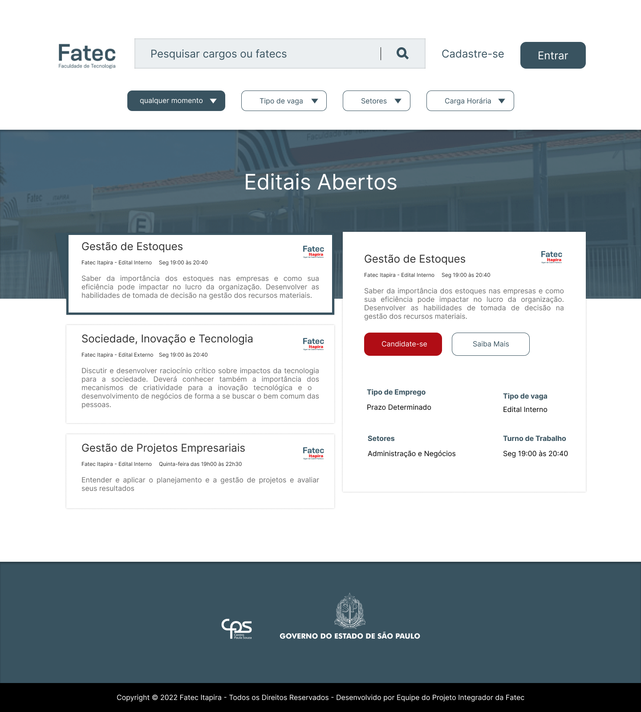

# 📚 Fatec Itapira - Projeto Integrador

Projeto semestral da FATEC Itapira, modelo de projeto interdisciplinar
que combina a teoria e a prática, principal modelo da instituição.

## Objetivos

- [x] Desenvolver PM Canvas
- [x] Análise de Requisitos
- [x] Telas de Figma
- [ ] Implementação Front-End (HTML, CSS e JavaScript)
- [X] Diagrama de Caso de Uso
- [x] Desenvolver Documentos de Requisitos Funcionais e Não Funcionais
    - [X] Cadastrar:
        - [X] Usuários (Professores, Administrador, Coordenadores)
        - [X] Editais
        - [X] Documentos Comprobatórios
    - [X] Gerar reetificação de editais através de documentos de portaria
    - [X] Gerenciar:
        - [X] Usuários (Professores, Administrador, Coordenadores)
        - [X] Editais

## 💭 Proposta de Trabalho

A proposta é reunir em um único site todo ou parcialmente
o fluxo de trabalho de contratação de um novo professor de um edital interno.
Desde a liberação do edital até a revisão dos formulário pela coordenadoria.
O processo deve ser público e atualizar aqueles que manifestaram interesse.

## ✂ Etapas do Projeto

O primeiro semestre cabe desenvolver design e principios básicos de desenvolvimento como a colaboração e a comunicação.
Um mentor (alguém que possua um pouco mais de experiência técnica) deve ser o principal
responsável pelo projeto, orientar os outros alunos e trocarem experiência.

Mentor: [Gabriel Almir @momentoalmir](https://github.com/momentoalmir)
Sujestões realizadas:
    * trabalho via pair programing em sala
    * versiomento de código via Git
    * orientação de principios básicos html/css
    * criação de design conhecendo todas etapas de maturização do projeto

## 🎨 Design

Naquilo que condiz a marca FATEC ou CPS, é estritamente necessário seguir
a [identidade visual do Centro Paula Souza](https://bkpsitecpsnew.blob.core.windows.net/uploadsitecps/sites/1/2022/05/manual_centro_paula_souza_gestao2019_atualizado_mes05.pdf)

Cores:

Vermelho: #B11116
Azul: #3A5461
Preto: #000
Branco: #FFF

### Página Inicial

Visando simplificar as etapas de pesquisa e filtro dos editais disponíveis na FATEC,
sugerimos uma tela simplificada que reuni todo processo para encontrar vagas em uma única tela.

